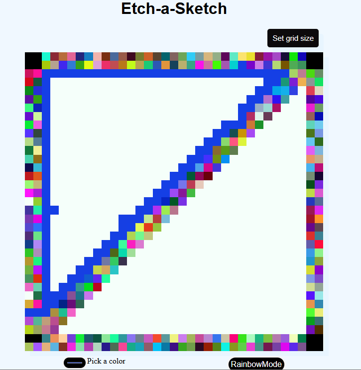

# Etch-a-sketch Project 🎨

A browser-based sketching board where you can draw pixel art by hovering or clicking over a customizable grid. Built with vanilla JavaScript, HTML, and CSS — no frameworks, just pure DOM manipulation.

✨ Highlights

🎛️ Dynamic grid sizing – choose how many squares per side.

🖌️ Drawing modes – normal color mode or rainbow mode (random colors).

🎨 Custom colors – select your own drawing color.

📐 Responsive board – squares resize automatically to fit the container.

🧑‍💻 Behind the Scenes

This project is more than just a sketch board — it’s an exercise in The Odin Project JavaScript fundamentals:

Creating elements dynamically with document.createElement.

Managing a grid layout using CSS Flexbox.

Adding and removing event listeners for interactivity.

Writing functions that adapt based on user input.

Using math and randomization for rainbow colors.

🚀 Getting Started

Clone the repository:

git clone https://github.com/ofosunewton/etch-a-sketch.git

Open index.html in your browser.

Start sketching!

📸 Demo

🔮 Next Steps

Some features I’d like to add in the future:

Eraser tool 🧽

Save drawings as images 📷

Touch support for mobile ✋

🙏 Credits

Inspired by The Odin Project
.

